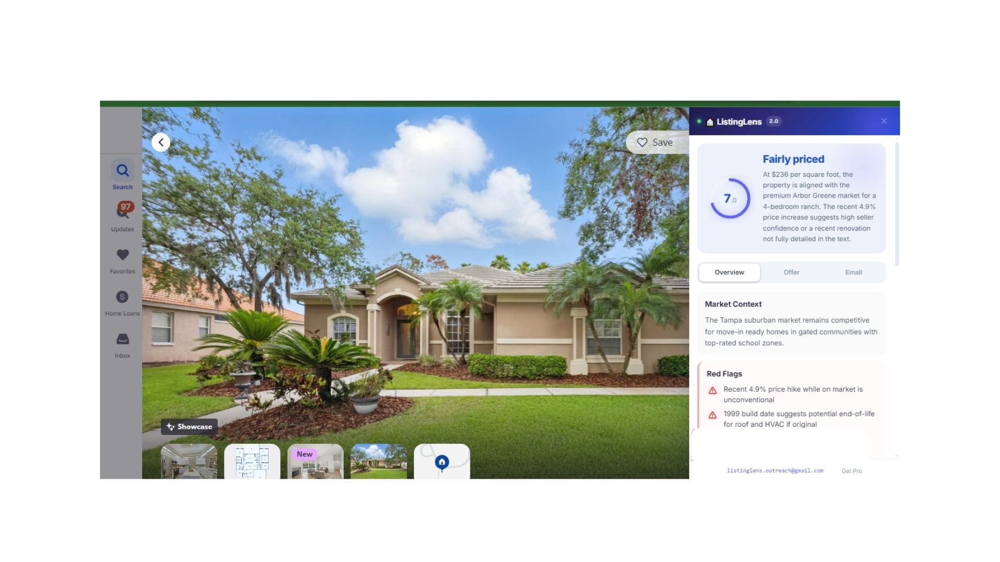
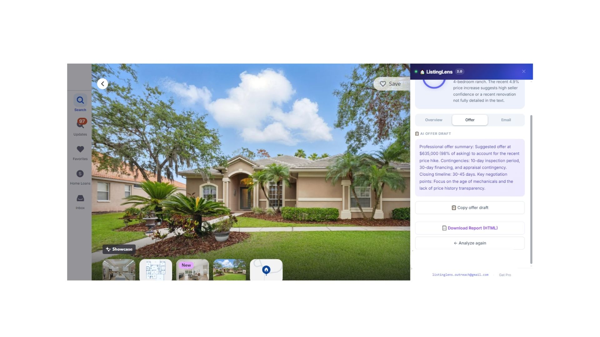
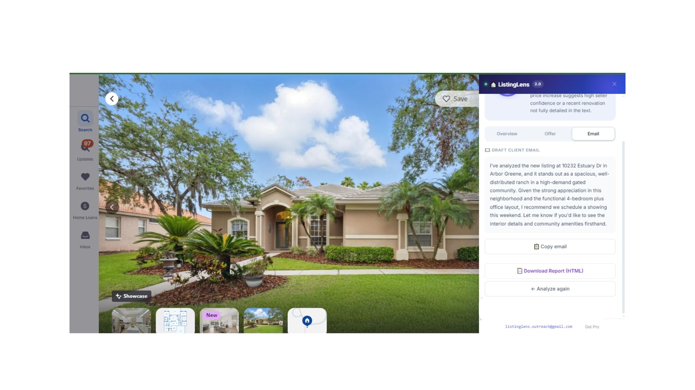

<p align="center">
  
</p>

<h1 align="center">ListingLens</h1>
<p align="center"><b>AI listing analysis for real estate agents — right inside Zillow, Realtor.com, and Redfin.</b></p>

<p align="center">
  <a href="https://chromewebstore.google.com/detail/dofgafejioiplaoiafbgihbkalifbfak">Install on Chrome</a>
  ·
  <a href="mailto:listinglens.outreach@gmail.com">Contact</a>
</p>

---

## What it is

ListingLens is a Chrome extension that adds an AI-powered analysis sidebar to any home listing page on **Zillow**, **Realtor.com**, or **Redfin** (including `redfin.ca` for Canada). One click pulls the listing data straight off the page and returns a price verdict, red flags, negotiation angles, and a client-ready email — in seconds, without leaving the tab.

It's built for real estate agents, buyer's agents, and investors who evaluate listings daily and want a faster, data-backed first read before recommending a showing.

## Features

- **Price score** — a 1–10 value score with a plain-language verdict (Good deal / Fairly priced / Possibly overpriced / Needs investigation)
- **Red & green flags** — concerns and positives pulled from the listing data
- **Smart questions** — ready to ask the listing agent
- **Market context** — a quick read on current conditions for the area
- **AI Offer Generator** *(Pro)* — suggested offer price, contingencies, and closing timeline
- **Negotiation tips** *(Pro)* — tactics specific to this listing's data
- **Comparable sales context** *(Pro)* — how the listing stacks up nearby
- **Client-ready email** — a short, professional email draft after every analysis
- **PDF report** *(Pro)* — a shareable one-page summary for your buyer client

Free tier includes 5 full analyses, no signup and no credit card required.

## Screenshots

| Overview | Offer draft | Client email |
|---|---|---|
|  |  |  |

## Supported sites

| Site | Region |
|---|---|
| zillow.com | US |
| realtor.com | US |
| redfin.com | US |
| redfin.ca | Canada |

## How it works

1. **Scrape** — `content.js` reads the listing's price, address, beds/baths, square footage, description, and other on-page facts.
2. **Analyze** — the scraped data is sent to a backend Worker, which prompts an AI model and returns a structured analysis (verdict, flags, offer draft, etc.) as JSON.
3. **Render** — the sidebar renders the analysis directly on the listing page, with free vs. Pro sections gated based on subscription status.

```
content.js (scrape) → Worker API (AI call + paywall/usage tracking) → sidebar UI
```

`background.js` is a service worker that re-injects the content script on same-tab SPA navigation (e.g. clicking between listings on Zillow without a full page reload).

## Installation

**From the Chrome Web Store** (recommended): [Install ListingLens →](https://chromewebstore.google.com/detail/dofgafejioiplaoiafbgihbkalifbfak)

**From source (development):**
1. Clone this repository
2. Open `chrome://extensions` in Chrome
3. Enable **Developer mode** (top right)
4. Click **Load unpacked** and select the cloned folder
5. Open any listing on Zillow, Realtor.com, or Redfin and click **Analyze this listing**

## Pricing

- **Free** — 5 analyses included, no signup
- **Pro** — $15/month: unlimited analyses, Offer Generator, Negotiation Tips, Comparable Sales, and PDF reports

## Tech stack

- Manifest V3 Chrome extension (vanilla JS, no build step)
- Cloudflare Worker backend for the AI call and Stripe subscription checks
- Stripe for billing

## Support

Questions or feedback: [listinglens.outreach@gmail.com](mailto:listinglens.outreach@gmail.com)
